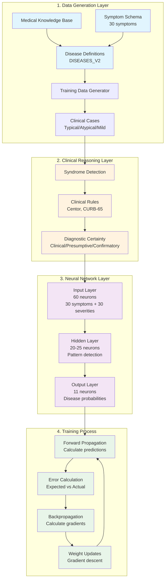

## PythonNeuralNet

[](https://www.python.org/downloads/)
[](#)
[](LICENSE)

This repository began as a hands‑on learning project to understand how modern AI systems are built from first principles: data representation, forward propagation, loss calculation, backpropagation, and weight updates. It started with a minimal neural network that recognizes binary patterns and evolved into a clinically sensible medical diagnosis system that reasons like a doctor.

Below you’ll find:

- A clear description of the foundational neural network and its training process
- Standalone model sections that use the same foundation, including their training datasets
- How to run each model and extend the project structure

### Getting Started

```bash
# Clone and enter the project
git clone <repo-url>
cd PythonNeuralNet

# Create a virtual environment
python3 -m venv venv
source venv/bin/activate

# Install dependencies (PDF export for medical model)
pip install -r requirements.txt

# Run the medical diagnosis model (full demo)
cd medical_diagnosis_model
python enhanced_medical_system.py

# Or start from the foundation in your own project
# cp -r ../foundational_brain ../my_new_model
# ...and build from NeuralNet.py
```

## How the Neural Network Is Structured and Trained

### Architecture

- **Layers**: Input → Hidden → Output
- **Weights and Biases**: Each neuron has a weight per input and a bias term
- **Activation**: Sigmoid for non‑linearity, outputs in [0, 1]
- **Outputs**: Multi‑class probabilities (one output neuron per class)

### Forward Propagation (prediction)

1. For each layer, compute neuron activation: weighted_sum(inputs) + bias
2. Pass activations through the sigmoid transfer function
3. The output layer yields class scores (probabilities after normalization)

### Loss Function

- Uses mean squared error (MSE) between expected one‑hot targets and predicted outputs

### Backpropagation (learning)

1. Compute output layer error (expected − actual)
2. Propagate error backward through hidden layers
3. Multiply error by the derivative of the sigmoid to obtain each neuron’s delta
4. Use deltas to update each weight by gradient descent

### Weight Update Rule

- `new_weight = old_weight + learning_rate * delta * input_value`
- Bias is updated by `learning_rate * delta`

### Training Loop

- Iterate over epochs → for each training example:
  - Forward propagate
  - Compute loss and deltas
  - Update weights
- Enhancements used in this repo:
  - Early stopping when total error dips below a small threshold
  - Verbose, periodic progress reporting
  - Configurable hidden layer size

## Models Built on the Foundation

### Foundational Brain (Pattern Recognition)

- Path: `foundational_brain/`
- Core file: `foundational_brain/NeuralNet.py`

#### What it is

The smallest useful implementation of a feedforward neural network with backpropagation. Designed to classify simple patterns, it serves as the reusable base for more complex models.

#### Training set

- Flexible by design. Originally demonstrated with 5 binary inputs and a single binary label per row (one‑hot encoded across the output layer). You can plug in any tabular dataset shaped as `[feature_1, ..., feature_n, label]`.

#### Highlights

- Sigmoid activation, per‑neuron biases
- Mean squared error loss
- Early stopping and progress logs
- Clean module import (main guard prevents side effects when importing)

### Medical Diagnosis Model (Clinical Reasoning)

- Path: `medical_diagnosis_model/`
- Key files:
  - Knowledge base: `medical_symptom_schema.py`, `medical_disease_schema_v2.py`
  - Training/data: `medical_training_generator.py`, `medical_diagnosis_model/data/`
  - Networks: `medical_neural_network_v2.py` (clinical reasoning), `NeuralNet.py` (foundation)
  - UI + features: `enhanced_medical_system.py`, `diagnosis_history.py`, `pdf_exporter.py`
  - Documentation: `README.md`, `training_architecture_diagram.md`

#### What it is

An end‑to‑end diagnosis system that first recognizes a clinical syndrome (e.g., Viral URI) and only “steps down” to specific diseases (e.g., Influenza) when appropriate testing is available. It includes ICD‑10 codes, differential diagnosis, severity assessment, clinical decision rules, patient history, and PDF export.

#### Inputs and representation

- 60 input features per case:
  - 30 binary flags for symptom presence (0/1)
  - 30 continuous severities scaled to [0, 1] (e.g., 8/10 severity → 0.8)

#### Training set

- Data are programmatically generated to mirror real clinical variability:
  - Typical cases (~80%): follow per‑disease symptom frequencies and severity ranges
  - Atypical cases (~10%): key symptom(s) missing to teach robustness
  - Mild/Early cases (~10%): reduced severities to mimic early presentation
  - Optional mixed/co‑morbid examples where appropriate

#### Clinical reasoning additions

- Syndrome detection (e.g., Respiratory Febrile vs. Gastrointestinal)
- Diagnostic certainty levels: Clinical / Presumptive / Confirmatory
- Decision rules (e.g., Centor criteria for strep)
- Red‑flag checks (e.g., concerning dyspnea, chest pain)
- Appropriate differentials scoped to the syndrome (no unrelated diseases)

#### Outputs

- Ranked disease probabilities plus:
  - Syndrome identified
  - Diagnostic certainty
  - Required/supportive tests (when applicable)
  - Differential diagnosis with brief discriminators
  - Recommendations (testing, follow‑up, safety guidance)

#### How to run (recommended)

```bash
cd medical_diagnosis_model
python3 -m venv venv
source venv/bin/activate
pip install -r requirements.txt   # reportlab for PDF export
python enhanced_medical_system.py
```

See `medical_diagnosis_model/training_architecture_diagram.md` for a dedicated page, or view the diagram inline below.

### Visual: End‑to‑End Training Flow (Mermaid)



## Repository Structure

```text
PythonNeuralNet/
├── foundational_brain/            # Reusable base neural network
│   ├── NeuralNet.py
│   └── README.md
│
├── medical_diagnosis_model/       # Clinical diagnosis application
│   ├── NeuralNet.py               # Dependency (foundation)
│   ├── medical_symptom_schema.py
│   ├── medical_disease_schema_v2.py
│   ├── medical_training_generator.py
│   ├── medical_neural_network_v2.py
│   ├── enhanced_medical_system.py
│   ├── diagnosis_history.py
│   ├── pdf_exporter.py
│   ├── models/                    # Saved model artifacts
│   ├── data/                      # Generated datasets/examples
│   ├── exports/                   # PDF and output artifacts
│   ├── diagnosis_history/         # Saved sessions
│   ├── README.md
│   └── training_architecture_diagram.md
│
├── PROJECT_STRUCTURE.md           # How this repo is organized
├── requirements.txt               # Project dependencies
└── README.md                      # This document
```

## License

This project is licensed under the MIT License. See `LICENSE` for details.

## Extending the Project

- Start new models from `foundational_brain/`
- Keep each model self‑contained in its own folder with code, data, and docs
- Reuse `NeuralNet.py` and the training loop; swap in a new dataset and task‑specific logic

## Medical Disclaimer

The medical diagnosis model is for educational and research purposes only. It is not a medical device and must not be used as a substitute for professional medical advice, diagnosis, or treatment.
