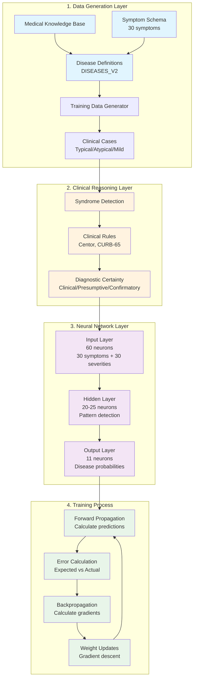

# Medical Neural Network Training Architecture

This diagram shows the complete training process for the enhanced medical diagnosis system.

## Layer Descriptions

### 1. Data Generation Layer

- **Medical Knowledge Base**: Contains symptom definitions, disease patterns, and medical relationships
- **Disease Definitions (DISEASES_V2)**: 11 diseases with syndrome-level and specific diagnoses
- **Training Data Generator**: Creates realistic patient cases with typical (80%), atypical (10%), and mild (10%) presentations

### 2. Clinical Reasoning Layer

- **Syndrome Detection**: Groups symptoms into clinical syndromes (Respiratory Febrile, GI, etc.)
- **Clinical Rules**: Applies medical decision rules like Centor criteria for strep throat
- **Diagnostic Certainty**: Determines if diagnosis needs confirmatory testing

### 3. Neural Network Layer

- **Input Layer**: 60 features (30 binary symptom flags + 30 severity values)
- **Hidden Layer**: 20-25 neurons that learn medical patterns
- **Output Layer**: 11 neurons representing disease probabilities

### 4. Training Process

- **Forward Propagation**: Calculates predictions using current weights
- **Error Calculation**: Compares predictions to expected diagnosis (considers clinical rules)
- **Backpropagation**: Calculates how to adjust weights to reduce error
- **Weight Updates**: Applies gradient descent to improve predictions

## Key Innovations

1. **Syndrome-First Approach**: Diagnoses "Viral URI" instead of jumping to "Influenza"
2. **Test Requirements**: Knows when laboratory confirmation is needed
3. **Clinical Rules Integration**: Applies medical decision-making during training
4. **Realistic Data**: Generates medically accurate training cases

This architecture allows the network to think like a doctor, starting broad and narrowing down only when appropriate.
